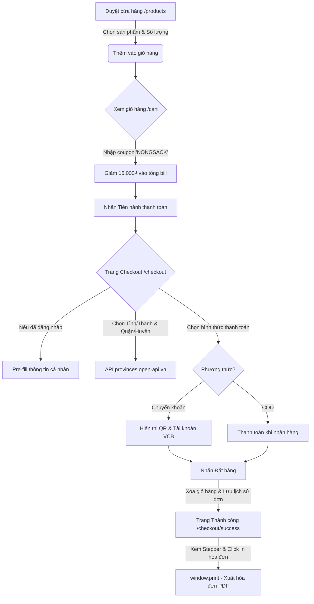
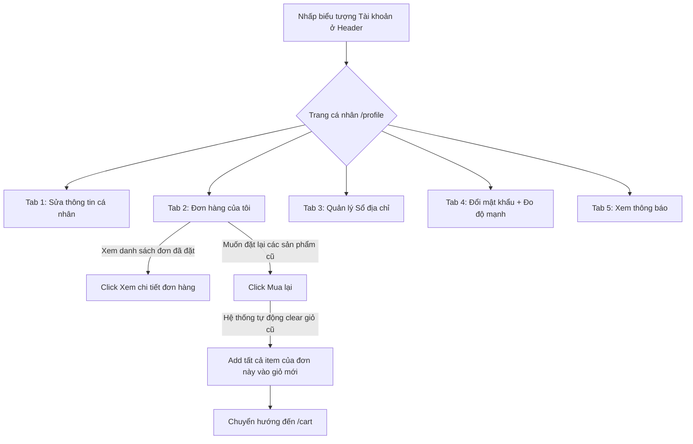

# 🌿 NôngSạch — Nền tảng giao dịch nông sản sạch

> Kết nối trực tiếp nông dân Việt Nam với người tiêu dùng. Tươi ngon — An toàn — Tin cậy.
> Dự án được xây dựng theo chuẩn giao diện Material Design 3, tối ưu trải nghiệm người dùng (UX) và hiệu năng (SEO/Performance).

---

## 📌 Mục lục

1. [Giới thiệu dự án](#1-giới-thiệu-dự-án)
2. [Kiến trúc & Công nghệ sử dụng](#2-kiến-trúc--công-nghệ-sử-dụng)
3. [Hướng dẫn cài đặt & Khởi chạy](#3-hướng-dẫn-cài-đặt--khởi-chạy)
4. [Tài khoản kiểm thử (Mock Credentials)](#4-tài-khoản-kiểm-thử-mock-credentials)
5. [Hướng dẫn sử dụng các chức năng (User Manual)](#5-hướng-dẫn-sử-dung-các-chức-năng-user-manual)
   - [5.1. Trang chủ & Khám phá sản phẩm](#51-trang-chủ--khám-phá-sản-phẩm)
   - [5.2. Giỏ hàng & Áp mã giảm giá](#52-giỏ-hàng--áp-mã-giảm-giá)
   - [5.3. Quy trình Thanh toán (Checkout)](#53-quy-trình-thanh-toán-checkout)
   - [5.4. Hóa đơn & Trạng thái đặt hàng thành công](#54-hóa-đơn--trạng-thái-đặt-hàng-thành-công)
   - [5.5. Trang quản lý cá nhân (Profile Dashboard)](#55-trang-quản-lý-cá-nhân-profile-dashboard)
   - [5.6. Trang Giới thiệu & Liên hệ](#56-trang-giới-thiệu--liên-hệ)
6. [Sơ đồ luồng nghiệp vụ (Business Flow Diagrams)](#6-sơ-đồ-luồng-nghiệp-vụ-business-flow-diagrams)
7. [Cấu trúc thư mục dự án](#7-cấu-trúc-thư-mục-dự-án)
8. [Tài liệu tham khảo liên quan](#8-tài-liệu-tham-khảo-liên-quan)

---

## 1. Giới thiệu dự án

**NôngSạch** là một nền tảng thương mại điện tử chuyên biệt kết nối trực tiếp nông sản sạch từ các vùng nông trại VietGAP của Việt Nam (Đà Lạt, Lâm Đồng, Bến Tre, Sóc Trăng,...) đến tay người tiêu dùng. Dự án giải quyết hai bài toán cốt lõi:
- **Người tiêu dùng**: Dễ dàng tiếp cận nguồn thực phẩm an toàn, có xuất xứ rõ ràng, giá cả bình ổn nhờ cắt giảm khâu trung gian thương lái.
- **Nông dân**: Tăng thu nhập bền vững bằng cách trực tiếp bán hàng thông qua nền tảng số hóa hiện đại.

---

## 2. Kiến trúc & Công nghệ sử dụng

Hệ thống được phát triển trên các công nghệ web hiện đại, đảm bảo tính mở rộng cao và trải nghiệm mượt mà:

| Thành phần | Công nghệ | Mục đích |
|---|---|---|
| **Core Framework** | Next.js 16 (App Router) | Render phía Server (SSR), tối ưu SEO, Routing động. |
| **Language** | TypeScript (Strict mode) | Ràng buộc kiểu dữ liệu chặt chẽ, giảm thiểu lỗi runtime. |
| **Styling** | Tailwind CSS v4 & Vanilla CSS | Hệ thống giao diện hiện đại, responsive, nạp biến tokens MD3. |
| **State Management** | Zustand v5 + Persist | Lưu trữ trạng thái Giỏ hàng và Xác thực phía Client, đồng bộ sang `localStorage`. |
| **UI Icons** | Material Symbols Outlined | Đồng bộ biểu tượng thiết kế theo phong cách Material Design 3. |
| **Font** | Be Vietnam Pro (Google Fonts) | Kiểu chữ tiếng Việt thanh lịch, hiển thị tốt trên mọi thiết bị. |
| **Database & API** | Static Mock Data + Open API | Chứa 8 nhóm sản phẩm VietGAP; Tích hợp API Tỉnh/Thành phố động. |

---

## 3. Hướng dẫn cài đặt & Khởi chạy

### Yêu cầu hệ thống trước khi cài đặt:
- **Node.js** phiên bản $\ge$ 18.18.0
- **npm** phiên bản $\ge$ 9.x

### Các bước khởi chạy dự án:

#### Bước 1: Mở thư mục dự án
Mở terminal tại thư mục gốc của project:
```bash
cd nong-sach
```

#### Bước 2: Cài đặt các thư viện phụ thuộc (Dependencies)
```bash
npm install
```

#### Bước 3: Thiết lập các biến môi trường
Sao chép tệp tin cấu hình mẫu `.env.example` thành `.env.local`:
```bash
cp .env.example .env.local
```
*(Giai đoạn này dự án đang dùng dữ liệu Mock cục bộ và xác thực Client-side qua Zustand để kiểm thử nhanh, bạn có thể để trống hoặc điền thông tin Firebase nếu phát triển tiếp).*

#### Bước 4: Khởi động Server phát triển (Development)
> [!IMPORTANT]
> **Lưu ý đặc biệt khi chạy trên Windows**:
> Do thư mục dự án nằm trên đường dẫn chứa ký tự Tiếng Việt có dấu (`D:\Thực tập\Buoi3\nong-sach`), công cụ compile Turbopack của Next.js có thể gặp lỗi panic. Chúng tôi đã cấu hình sẵn trong `package.json` để chạy bằng **Webpack** nhằm đảm bảo tính ổn định tối đa. 
> 
> Bạn hãy khởi chạy dự án bằng lệnh sau:

```bash
npm run dev
```
Sau khi khởi chạy thành công, truy cập vào ứng dụng tại địa chỉ: [http://localhost:3000](http://localhost:3000)

#### Bước 5: Đóng gói và chạy Production
Để kiểm tra phiên bản tối ưu hóa cho môi trường thực tế:
```bash
npm run build
npm run start
```

---

## 4. Tài khoản kiểm thử (Mock Credentials)

Để giúp các nhà phát triển và người dùng trải nghiệm ngay lập tức các tính năng nâng cao mà không cần đăng ký tài khoản mới, hệ thống đã chuẩn bị sẵn tài khoản kiểm thử chính thức:

> [!TIP]
> ### 🔑 Tài khoản kiểm thử chính thức
> - **Email**: `nguyenvana@gmail.com`
> - **Mật khẩu**: `12345678`
> 
> **Dữ liệu được chuẩn bị sẵn cho tài khoản này**:
> - **Họ và tên**: Nguyễn Văn A
> - **Thông tin cá nhân**: Số điện thoại, ngày sinh, giới tính đã được điền sẵn.
> - **Lịch sử đơn hàng**: Có sẵn đơn hàng mẫu `#NS92831` trạng thái **Hoàn thành** chứa đầy đủ hình ảnh, số lượng và tổng tiền.
> - **Sổ địa chỉ**: Gồm 2 địa chỉ lưu trữ sẵn (1 địa chỉ chính mặc định tại Quận 1, TP.HCM và 1 địa chỉ phụ tại Đống Đa, Hà Nội).

---

## 5. Hướng dẫn sử dụng các chức năng (User Manual)

### 5.1. Trang chủ & Khám phá sản phẩm
1. **Trang chủ (`/`)**: 
   - Banner Hero lớn chứa hình ảnh nông trại xanh và nút kêu gọi hành động (CTA) "Mua ngay" dẫn trực tiếp đến cửa hàng.
   - Lưới 6 danh mục sản phẩm (Rau củ, Trái cây, Ngũ cốc, Củ quả, Thảo mộc, Hoa tươi) có màu sắc gradient sinh động.
   - Mục "Sản phẩm nổi bật" giới thiệu các mặt hàng bán chạy.
2. **Cửa hàng (`/products`)**:
   - Sử dụng thanh tìm kiếm phía trên Header hoặc ô lọc để tìm sản phẩm theo tên.
   - Lọc sản phẩm nhanh theo danh mục bằng dropdown danh sách.
   - Sắp xếp sản phẩm theo: **Giá tăng dần**, **Giá giảm dần**, hoặc **Tên từ A-Z**.
3. **Chi tiết sản phẩm (`/products/[id]`)**:
   - Hiển thị đầy đủ thông tin: Tên sản phẩm, giá bán lẻ, xuất xứ (Đà Lạt, Lâm Đồng, Bến Tre,...), số lượng tồn kho còn lại, và nhãn **"Hữu cơ" (Organic)** nếu có.
   - Bộ sưu tập 4 hình ảnh chất lượng cao bao gồm ảnh thực tế và các ảnh minh họa cùng nhóm danh mục.
   - Bộ chọn số lượng có hệ thống chống nhập quá số lượng tồn kho hiện tại.
   - Tab chi tiết cung cấp: Mô tả sản phẩm, Thông số kỹ thuật, và Đánh giá từ khách hàng.

---

### 5.2. Giỏ hàng & Áp mã giảm giá
1. **Truy cập Giỏ hàng (`/cart`)**: Click vào biểu tượng giỏ hàng trên thanh điều hướng Header.
2. **Quản lý sản phẩm**: 
   - Bạn có thể tăng/giảm số lượng của từng món bằng nút cộng/trừ dạng pill-shaped. Hệ thống sẽ tự động hiển thị cảnh báo `⚠️ Chỉ còn X sản phẩm` nếu bạn chọn gần sát mức tồn kho tối đa.
   - Click dấu `X` ở góc trên cùng bên phải mỗi thẻ sản phẩm để xóa món đó khỏi giỏ.
3. **Mã giảm giá (Coupon)**:
   - Hệ thống hỗ trợ mã giảm giá đặc biệt. Hãy nhập mã **`NONGSACK`** và nhấn **Áp dụng** để được giảm ngay **15.000₫** trực tiếp vào tổng hóa đơn mua hàng.
4. **Sidebar Tóm tắt đơn hàng**:
   - Hiển thị chi tiết Tạm tính, số tiền được giảm giá, và Tổng tiền thanh toán cuối cùng.
   - Chứa các nhãn cam kết chất lượng của NôngSạch (Thanh toán an toàn, Đổi trả 7 ngày, Giao hàng trong ngày).
   - Tích hợp thông tin liên hệ hỗ trợ nhanh qua Hotline & Zalo.

---

### 5.3. Quy trình Thanh toán (Checkout)
1. Từ giỏ hàng, nhấn **Tiến hành thanh toán** để sang trang `/checkout`.
2. **Tự động điền (Pre-fill)**: Nếu bạn đã đăng nhập tài khoản của mình hoặc tài khoản kiểm thử `nguyenvana@gmail.com`, hệ thống sẽ tự động lấy thông tin Họ tên, Email và Số điện thoại từ tài khoản của bạn để điền vào form.
3. **Địa chỉ thông minh (Province API)**:
   - Danh sách **Tỉnh / Thành phố** và **Quận / Huyện** được tải động từ API chính thức của Chính phủ Việt Nam (`provinces.open-api.vn`).
   - Sau khi chọn Tỉnh/Thành phố, danh sách Quận/Huyện tương ứng sẽ tự động cập nhật.
   - *Trong trường hợp mất kết nối mạng hoặc API gặp sự cố, hệ thống sẽ tự động chuyển sang chế độ dự phòng (fallback) gồm các thành phố lớn (Hồ Chí Minh, Hà Nội, Đà Nẵng) để đảm bảo trải nghiệm mua hàng không bị gián đoạn.*
4. **Phương thức thanh toán**:
   - **Thanh toán COD (Tiền mặt khi nhận hàng)**.
   - **Chuyển khoản ngân hàng**: Khi chọn mục này, hệ thống sẽ mở rộng giao diện hiển thị thông tin số tài khoản Vietcombank chính thức, chi nhánh, chủ tài khoản và mã QR để bạn quét nhanh bằng ứng dụng ngân hàng.
5. **Phí vận chuyển**: Tự động tính toán dựa trên hình thức giao hàng bạn chọn: Giao hàng Tiêu chuẩn (20.000₫), Giao hàng Nhanh (35.000₫ - giao trong 2h), hoặc Tự nhận tại cửa hàng (Miễn phí).

---

### 5.4. Hóa đơn & Trạng thái đặt hàng thành công
Sau khi hoàn tất đặt hàng, bạn sẽ được chuyển đến trang `/checkout/success`:
1. **Thông tin đơn hàng**:
   - Hiển thị mã đơn hàng dạng `NS-xxxxxxxx` kèm nút **Sao chép** nhanh vào clipboard.
   - Tóm tắt thông tin người nhận, địa chỉ giao hàng cụ thể, phương thức thanh toán đã chọn, và thời gian giao hàng dự kiến.
   - Chi tiết danh sách sản phẩm đã mua kèm giá tiền tương ứng.
2. **Tiến trình đơn hàng (Timeline Stepper)**:
   - Hiển thị trực quan quy trình xử lý đơn hàng gồm 4 bước: *Đặt hàng thành công* (đang active màu xanh), *Đang đóng gói*, *Đang giao hàng*, và *Đã nhận hàng*.
3. **In hóa đơn (Browser Print)**:
   - Nhấp vào nút **In hóa đơn** để mở trình quản lý in của hệ điều hành, cho phép bạn in hóa đơn ra giấy hoặc lưu trực tiếp dưới dạng tệp PDF để lưu trữ.
4. **Gợi ý sản phẩm thông minh**:
   - Ở cuối trang, hệ thống gợi ý 4 sản phẩm ngẫu nhiên mà bạn có thể yêu thích (đã tự động lọc bỏ các sản phẩm bạn vừa mua để tăng tính đa dạng).

---

### 5.5. Trang quản lý cá nhân (Profile Dashboard)
Để vào trang cá nhân, click vào biểu tượng **Tài khoản** ở góc trên bên phải thanh Header (khi đã đăng nhập). Trang cá nhân `/profile` được chia làm 5 tab chức năng:

* **Tab 1: Thông tin cá nhân**:
  - Xem và cập nhật Họ tên, Số điện thoại, Ngày sinh và Giới tính.
  - Trường Email được đặt ở chế độ chỉ đọc (Read-only) để đảm bảo tính định danh tài khoản.
  - Nhấp **Lưu thay đổi** để cập nhật dữ liệu.
* **Tab 2: Đơn hàng của tôi**:
  - Hiển thị toàn bộ các đơn hàng bạn đã đặt trên hệ thống (bao gồm cả đơn hàng bạn vừa thực hiện tại trang checkout).
  - Có bộ lọc đơn hàng theo trạng thái: **Tất cả**, **Đang xử lý**, và **Hoàn thành**.
  - Nhấp vào từng đơn hàng để xem chi tiết: danh sách sản phẩm, địa chỉ nhận hàng, phương thức thanh toán.
  - **Chức năng "Mua lại" (Re-order)**: Với các đơn hàng đã đặt thành công trong quá khứ, chỉ cần bấm nút **Mua lại**, hệ thống sẽ tự động dọn giỏ hàng hiện tại, thêm toàn bộ các sản phẩm trong đơn hàng cũ đó vào giỏ với đúng số lượng tương ứng, và đưa bạn thẳng đến trang Giỏ hàng để thanh toán nhanh.
* **Tab 3: Địa chỉ giao hàng**:
  - Quản lý danh sách sổ địa chỉ nhận hàng của bạn.
  - Cho phép thêm mới, chỉnh sửa thông tin, hoặc xóa địa chỉ.
  - Các ô chọn Tỉnh/Thành phố và Quận/Huyện hoạt động động qua API tương tự trang checkout.
  - Thiết lập một địa chỉ làm địa chỉ mặc định chính để hệ thống tự động chọn khi bạn mua hàng lần sau.
* **Tab 4: Đổi mật khẩu**:
  - Nhập mật khẩu hiện tại, mật khẩu mới và xác nhận mật khẩu mới.
  - Tích hợp **Thanh đo độ mạnh mật khẩu (Password Strength Meter)**: Khi gõ mật khẩu mới, hệ thống sẽ đánh giá độ bảo mật và hiển thị thanh màu sắc trực quan (Đỏ: Yếu, Vàng: Trung bình, Xanh lá: Mạnh).
* **Tab 5: Thông báo**:
  - Hiển thị các thông báo từ hệ thống, tin tức khuyến mãi mới nhất hoặc cập nhật trạng thái đơn hàng của bạn.

> [!TIP]
> **Đăng xuất tài khoản**: Nút đăng xuất được tích hợp an toàn ở cuối thanh menu Sidebar của trang cá nhân.

---

### 5.6. Trang Giới thiệu & Liên hệ
1. **Giới thiệu (`/about`)**:
   - Cung cấp câu chuyện hình thành thương hiệu NôngSạch.
   - Thống kê các con số ấn tượng (Hơn 10,000 khách hàng, hơn 50 đối tác nông trại,...).
   - Đội ngũ sáng lập và biểu mẫu kêu gọi mua sắm được tích hợp ảnh nền nông trại hữu cơ đẹp mắt.
2. **Liên hệ (`/contact`)**:
   - Biểu mẫu gửi liên hệ gọn gàng hỗ trợ nhập thông tin và chọn chủ đề hỗ trợ (Đặt hàng, Khiếu nại, Hợp tác,...).
   - Bản đồ vị trí văn phòng/cửa hàng hiển thị rõ nét trên giao diện gọn gàng.
   - Hộp đăng ký nhận bản tin khuyến mãi (Newsletter) chống vỡ chữ trên các thiết bị.

---

## 6. Sơ đồ luồng nghiệp vụ (Business Flow Diagrams)

### Luồng mua hàng & thanh toán (Checkout Flow)



### Luồng quản lý tài khoản & Mua lại (Profile & Re-order Flow)



---

## 7. Cấu trúc thư mục dự án

```text
nong-sach/
├── docs/                 # Tài liệu đặc tả và thiết kế hệ thống
│   ├── SPEC.md           # Tài liệu đặc tả sản phẩm (Product Spec)
│   ├── ARCHITECTURE.md   # Tài liệu kiến trúc hệ thống (System Architecture)
│   └── CHANGELOG.md      # Nhật ký thay đổi chi tiết qua các phiên bản
├── public/               # Các tài nguyên tĩnh (Hình ảnh, Logos, SVG)
├── src/
│   ├── app/              # Next.js App Router Pages
│   │   ├── about/        # Trang Giới thiệu (About Us)
│   │   ├── cart/         # Trang chi tiết Giỏ hàng
│   │   ├── checkout/     # Trang thanh toán & trang success (/checkout/success)
│   │   ├── contact/      # Trang Liên hệ & Bản đồ
│   │   ├── login/        # Trang Đăng nhập tài khoản
│   │   ├── register/     # Trang Đăng ký tài khoản
│   │   ├── products/     # Trang Danh sách & Chi tiết sản phẩm ([id])
│   │   ├── profile/      # Trang cá nhân Dashboard quản lý tài khoản
│   │   ├── globals.css   # Tệp CSS cấu hình biến màu MD3 & custom animations
│   │   ├── layout.tsx    # Giao diện khung dùng chung toàn ứng dụng (Root Layout)
│   │   └── page.tsx      # Giao diện Trang chủ (Landing Page)
│   ├── components/       # Các thành phần tái sử dụng
│   │   ├── layout/       # Header, Footer, PageShell, Breadcrumbs
│   │   ├── product/      # ProductCard, ProductGrid, ProductDetail
│   │   └── ui/           # Các nút bấm, nhãn trạng thái nhỏ
│   ├── data/             # Cơ sở dữ liệu tĩnh (mockProducts.ts)
│   ├── store/            # Quản lý trạng thái Zustand (cart-store.ts, auth-store.ts)
│   └── types/            # Khai báo các TypeScript Interfaces (user.ts, index.ts)
├── package.json          # Danh sách thư viện & scripts khởi chạy dự án
└── README.md             # Hướng dẫn sử dụng & cài đặt hệ thống (Tài liệu này)
```

---

## 8. Tài liệu tham khảo liên quan

Để tìm hiểu sâu hơn về thiết kế kỹ thuật của dự án, vui lòng đọc thêm các tài liệu đính kèm:
- [Tài liệu Đặc tả sản phẩm (SPEC.md)](./docs/SPEC.md) — Chi tiết tính năng MVP và Backlog tương lai.
- [Tài liệu Kiến trúc hệ thống (ARCHITECTURE.md)](./docs/ARCHITECTURE.md) — Chi tiết luồng dữ liệu, cấu trúc các State Store của Zustand.
- [Lịch sử thay đổi (CHANGELOG.md)](./docs/CHANGELOG.md) — Theo dõi tiến độ cập nhật của các Sprint phát triển.

---
☘️ **NôngSạch Team — Chúc bạn có những trải nghiệm mua sắm nông sản tuyệt vời!**
